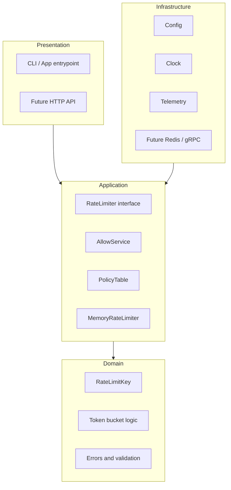
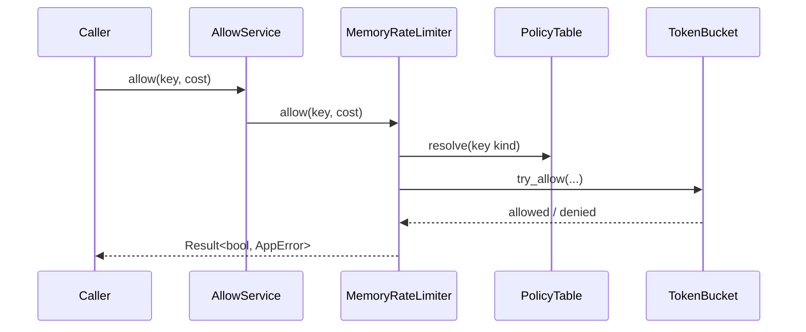

# distributed-ratel

`distributed-ratel` is a Rust rate limiter for API protection, fair usage control, and traffic shaping.

It works as an embedded single-node limiter today, with the codebase structured so it can grow into a Redis-backed and eventually distributed rate limiting service.

---

## Overview

This project is aimed at teams that need to:

- protect APIs from bursts and abuse
- apply different limits to users, IPs, or API keys
- control cost for expensive endpoints
- start simple without blocking future scale-out

The current implementation focuses on a clean, testable core rather than a large feature surface.

---

## Current Features

- token-bucket rate limiting
- in-memory single-process engine
- typed keys: `user_id`, `ip`, `api_key`, and `custom`
- configurable policies by key kind
- variable request cost
- async `RateLimiter` interface
- tracing-based logging
- unit-tested core behavior

---

## Common Use Cases

- API gateways that need request throttling
- backend services that want per-user or per-key quotas
- systems with expensive operations where each request should consume configurable capacity
- products that want to start with local rate limiting and later move to shared infrastructure

---

## Architecture

The project uses a layered design so the core limiting logic stays stable while storage and transport can evolve.



### Request Flow



---

## Current Status

| Area | Status |
|------|--------|
| Foundations | Complete |
| Single-node core engine | Complete |
| Redis-backed shared storage | Planned |
| HTTP API layer | Planned |
| Multi-node routing | Planned |
| Observability and hardening | Planned |

The project is already usable for embedded application-side limiting, but it is still early-stage.

---

## Getting Started

Run the example from the project root:

```bash
cargo run
```

Run tests:

```bash
cargo test
```

---

## Configuration

Default settings live in [`config/default.toml`](./config/default.toml).

Current sample values:

- default policy: `capacity = 100`, `refill_per_second = 10.0`
- `user_id` policy: `capacity = 50`, `refill_per_second = 5.0`

Environment overrides are supported with `RATEL__...` keys.

Example:

```bash
RATEL__RATE_LIMIT__DEFAULT__CAPACITY=200 cargo run
```

---

## Technical Notes

For technical readers, the current codebase includes:

- `RateLimitKey` for typed identities
- `PolicyTable` for per-key-kind policy resolution
- `MemoryRateLimiter` as the active engine
- `AllowService` as the application-facing entrypoint
- monotonic time handling for predictable token refill behavior

The structure is intended to make later additions like Redis, HTTP, and distributed routing easier to add without replacing the core logic.

---

## Planned Direction

The next steps for the project are:

- Redis-backed shared state
- an HTTP API for service deployment
- performance improvements such as batching and caching
- multi-node routing and sharding
- stronger observability and resilience features

