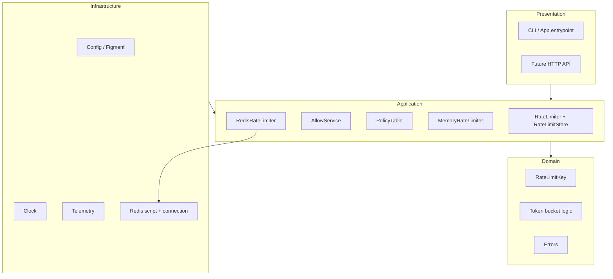
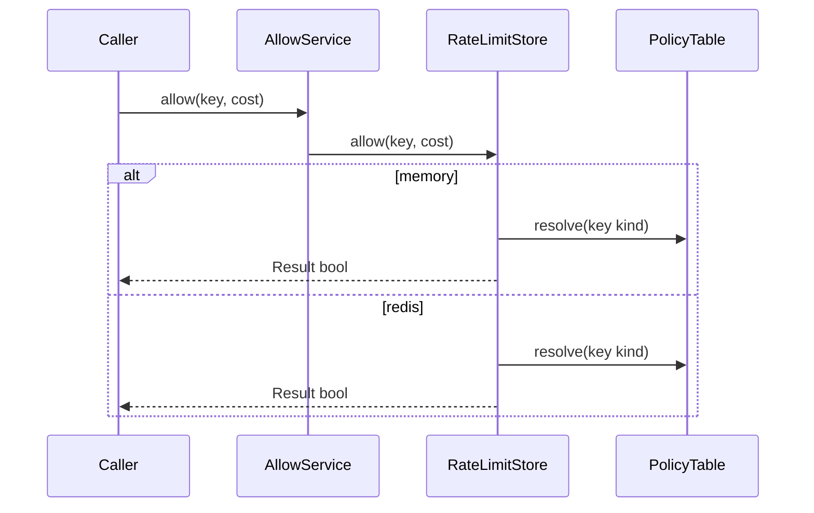

# distributed-ratel

`distributed-ratel` is a Rust rate limiter for API protection, fair usage control, and traffic shaping.

It runs **in-memory** on one machine or **backed by Redis** so multiple instances share the same counters. The layout is meant to grow toward an HTTP service and multi-node routing without rewriting the core.

---

## Overview

This project is aimed at teams that need to:

- protect APIs from bursts and abuse
- apply different limits to users, IPs, or API keys
- control cost for expensive endpoints
- start with a local engine and **switch to Redis** via config when you need shared limits

The implementation favors a **clear layered design** and a stable **`RateLimiter::allow`** contract over a huge feature surface.

---

## Current features

- **Token-bucket** rate limiting (domain + in-memory path; Redis path uses an equivalent Lua algorithm on the server)
- **Two backends** (pick in config):
  - **Memory** — `DashMap` + per-key mutex, `MonotonicClock`
  - **Redis** — async `ConnectionManager`, **atomic Lua** script ([`lua/token_bucket.lua`](./lua/token_bucket.lua)), **TTL** (`PEXPIRE`), **`key_prefix`**, **fail-open / fail-close** on Redis errors
- **Typed keys:** `user_id`, `ip`, `api_key`, `custom` ([`RateLimitKey`](./src/domain/key.rs))
- **Policy by key kind** ([`PolicyTable`](./src/application/policy.rs))
- **Variable request cost** (`cost` on `allow`)
- **`RateLimiter`** + **`RateLimitStore`** ([`application/ports.rs`](./src/application/ports.rs)); [`AllowService`](./src/application/service.rs) delegates to a store
- **Figment** config: TOML + `RATEL__…` env overrides
- **`tracing`** logging

---

## Common use cases

- API gateways that need request throttling
- backend services with per-user or per-key quotas
- expensive operations where each request consumes configurable capacity
- **multiple app instances** sharing limits via **Redis**

---

## Architecture

Layered design: domain logic stays independent; stores plug in behind **`RateLimitStore`**.



### Request flow



---

## Current status

| Area | Status |
|------|--------|
| Foundations (keys, ports, config, tracing) | Complete |
| Single-node in-memory engine | Complete |
| **Redis-backed shared storage** | **Core complete** (Lua, TTL, prefix, fallback) |
| Pipeline / batch Redis ops | Not implemented |
| Phase 2.5 — sliding window + algorithm switch | Next (see [ROADMAP.md](./ROADMAP.md)) |
| HTTP API | Planned |
| Multi-node / gRPC | Planned |

---

## Getting started

From the **repository root** (so `config/default.toml` resolves):

```bash
cargo run
```

```bash
cargo test
```

Use **`[storage] backend = "memory"`** by default; set **`backend = "redis"`** and run Redis when you want shared state (see config below).

---

## Configuration

Defaults: [`config/default.toml`](./config/default.toml).

### Storage

| Key | Meaning |
|-----|--------|
| `storage.backend` | `memory` or `redis` |
| `storage.fallback_strategy` | `fail_open` or `fail_close` when Redis errors (memory backend ignores this) |
| `storage.redis.url` | Redis URL |
| `storage.redis.key_prefix` | Prefix for Redis keys (namespacing) |

### Rate limits

- `rate_limit.default` — `capacity`, `refill_per_second`
- `rate_limit.by_kind.<kind>` — optional overrides; kinds: `user_id`, `ip`, `api_key`, `custom`

### Environment overrides

Use the `RATEL__` prefix and `__` for nesting:

```bash
RATEL__RATE_LIMIT__DEFAULT__CAPACITY=200 cargo run
RATEL__STORAGE__BACKEND=redis cargo run
```

---

## Technical notes

- **Memory:** [`MemoryRateLimiter`](./src/application/memory_limiter.rs) implements [`RateLimitStore`](./src/application/ports.rs).
- **Redis:** [`RedisRateLimiter`](./src/infrastructure/redis_limiter.rs) implements **`RateLimitStore`**; script is embedded at compile time from **`lua/token_bucket.lua`** via **`include_str!`**.
- **Wiring:** [`main.rs`](./src/main.rs) builds `Arc<dyn RateLimitStore>` from config and passes it to **`AllowService::new`**.

---
